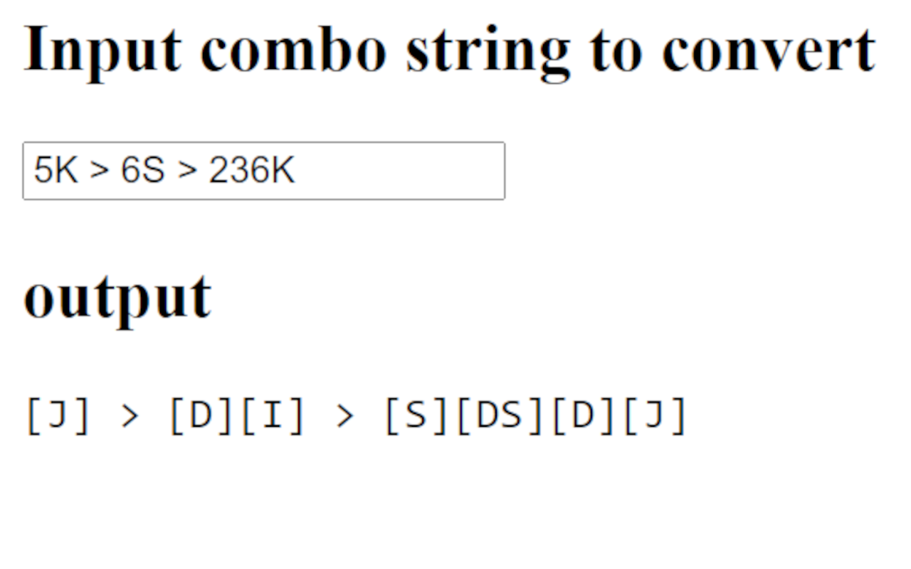
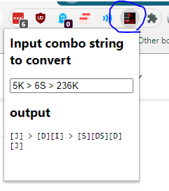

# guilty-gear-combo-string-wasd-converter

##

note: THIS PLUGIN IS DEAD, as I am lazy and extremely busy. Fork away. Or PR/etc. Hope it works in 2022! B)

## See also

- <https://greasyfork.org/en/scripts/14731-fighting-game-notationizer>

## Summary

GG Combo String WASD Converter Chrome Extension

I am switching from controller to keyboard.

I am too lazy to actually learn Guilty Gear notation.

So, I made a chrome app that converts normal notation into default keyboard notation!

Now I don't have to think about how to read combos!

## Contributing

If you fix/improve something, submit a PR and I'll likely accept. No license, IDK what you use this for. Just attribute me visibly.

## Install

1. Install from <https://chrome.google.com/webstore/detail/guilty-gear-wasd-converte/agfcifkinoekaakeilkfilnbiamfkkon?hl=en&authuser=0>
2. Click on the app in the upper right to open a little pop up (see this )
3. Paste in some combo strings!

## Dev't

Clone this repo and go to <chrome://extensions/> and "Load Unpacked" the folder `src/` containing `manifest.json`. Google "chrome load unpacked extension" if stuck.

## Changing the keybinds

Currently, there is no way to do this other than editing `convert.js`. This is a planned feature
