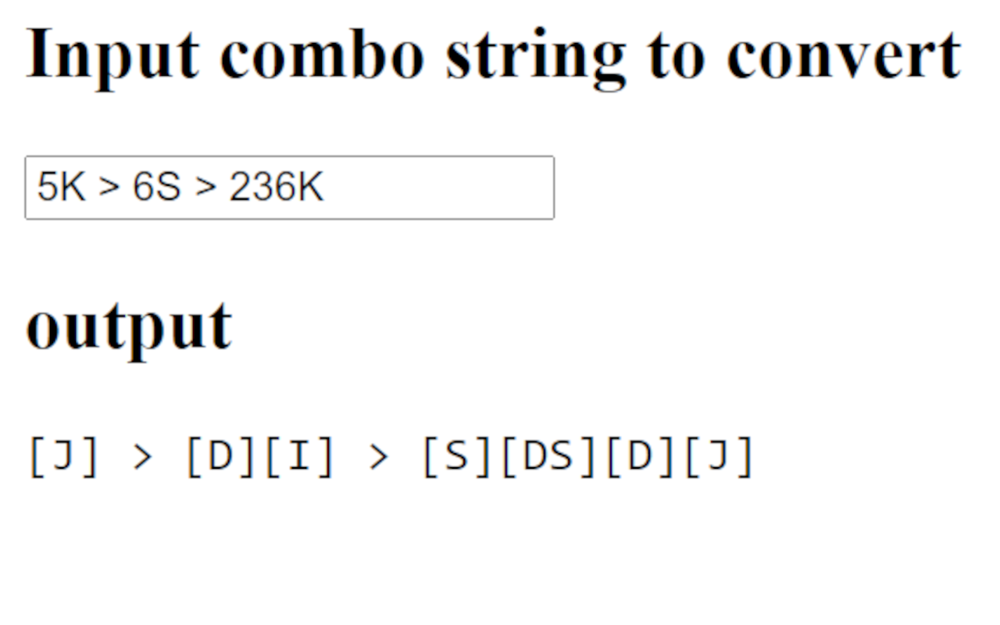

# guilty-gear-combo-string-wasd-converter
GG Combo String WASD Converter Chrome Extension

I am switching from controller to keyboard.

I am too lazy to actually learn Guilty Gear notation.

So, I made a chrome app that converts normal notation into default keyboard notation!

Now I don't have to think about how to read combos!

## Install

1. Install from (TBD)
3. Click on the app in the upper right to open a little pop up
4. Paste in some combo strings!

## Dev't

Clone this repo and go to <chrome://extensions/> and "Load Unpacked". Google "chrome load unpacked extension" if stuck.

## Changing the keybinds

Currently, there is no way to do this other than editing `convert.js`.
